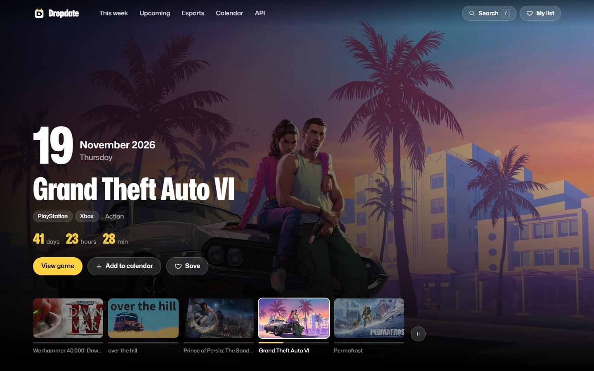
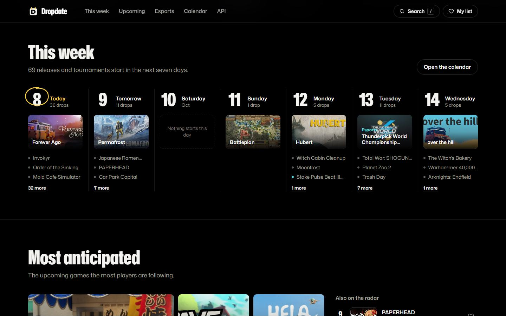
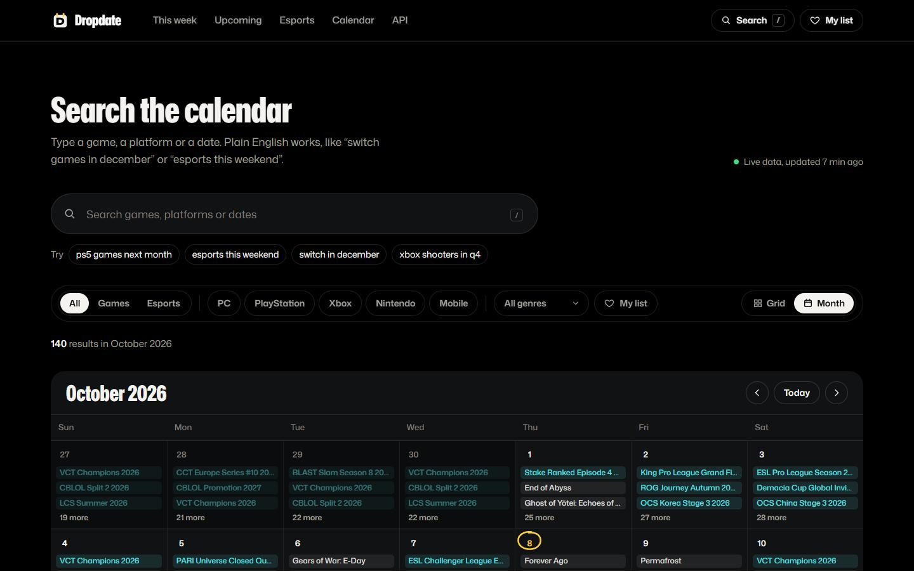
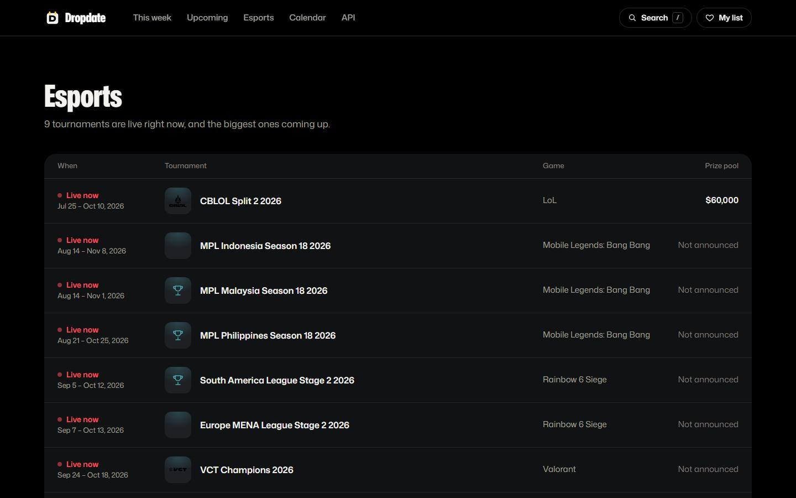

<div align="center">

<h1>Dropdate</h1>

<h3>Game releases and esports tournaments in one calendar</h3>

[](https://nextjs.org)
[](https://typescriptlang.org)
[](https://tailwindcss.com)

<hr>

<h2>About</h2>

<p>Dropdate lists upcoming game releases and esports tournaments in one calendar,<br>
refreshed every hour. Search it in plain English, filter by platform and genre,<br>
and add any view to your own calendar so it follows when a date moves.</p>

<p>The same live data is available as a free API with no keys and no sign-up.</p>

<hr>

<h2>Screenshots</h2>

<table align="center">
<tr>
<td align="center" width="50%">



<sub>Home</sub>

</td>
<td align="center" width="50%">



<sub>This week</sub>

</td>
</tr>
<tr>
<td align="center" width="50%">



<sub>Calendar</sub>

</td>
<td align="center" width="50%">



<sub>Esports</sub>

</td>
</tr>
</table>

<hr>


<h2>On the site</h2>

<table align="center">
<tr>
<td align="center" width="33%">

<h3>This week</h3>

Releases and tournaments<br>
starting in the next seven days<br>
Grouped by day

</td>
<td align="center" width="33%">

<h3>Most anticipated</h3>

Upcoming games the most<br>
players are following<br>
Plus what else is on the radar

</td>
<td align="center" width="33%">

<h3>Just released</h3>

The biggest launches<br>
of the past 30 days<br>
Ranked by followers

</td>
</tr>
<tr>
<td align="center" width="33%">

<h3>Esports</h3>

Live and upcoming tournaments<br>
Game, dates and prize pool

</td>
<td align="center" width="33%">

<h3>Search and filters</h3>

Plain English search<br>
Platform, genre and My list<br>
Grid or month view

</td>
<td align="center" width="33%">

<h3>Calendar sync</h3>

Google Calendar<br>
Apple Calendar or Outlook<br>
Or copy the feed link

</td>
</tr>
</table>

<hr>

<h2>Data</h2>

<table align="center">
<tr>
<td align="center" width="33%">

<h3>RAWG</h3>

Releases and artwork<br>
Game pages

</td>
<td align="center" width="33%">

<h3>Steam</h3>

Most wishlisted and<br>
most anticipated<br>
upcoming PC games

</td>
<td align="center" width="33%">

<h3>PandaScore</h3>

Esports series<br>
Running, upcoming<br>
and just finished

</td>
</tr>
</table>

<p>Every source is optional and fails soft: whatever answers is shown.</p>

<hr>

<h2>API</h2>

<p>Free, no keys, and any website can call it.<br>
Responses are JSON, or an iCalendar feed you can subscribe to.</p>

```bash
GET /api/events?q=ps5%20releases%20next%20month&limit=10
GET /api/tournaments?q=this%20week
GET /api/games?slug=cyberpunk-2077
GET /api/calendar.ics?type=release&q=xbox
```

<p>Filters: <code>q</code>, <code>type</code>, <code>platform</code>, <code>genre</code>, <code>past</code>, <code>limit</code> and <code>offset</code>.<br>
Full reference at <a href="https://dropdate.net/docs">dropdate.net/docs</a>.</p>

<hr>

<h2>Stack</h2>

```javascript
const stack = {
  app: ["Next.js 16", "React 19", "TypeScript"],
  styling: ["Tailwind CSS 4", "Inter"],
  data: ["RAWG", "Steam", "PandaScore"]
};
```

<hr>

<h2>Setup</h2>

<p>Needs Node.js 20.9 or newer.</p>

```bash
git clone https://github.com/gimzdev/dropdate.git
cd dropdate

npm install
npm run dev
```

<p>Add the keys you have to <code>.env.local</code>. A source without a key is skipped.<br>
Steam needs no key.</p>

```bash
RAWG_API_KEY=          # releases, artwork and game pages
PANDASCORE_TOKEN=      # esports tournaments

# optional
# PANDASCORE_TIERS=s,a,b,c
# STEAM_UPCOMING=off
# NEXT_PUBLIC_SITE_URL=https://dropdate.net
```

<hr>

[](https://dropdate.net)

<p><sub>Game data and artwork from RAWG and Steam, esports from PandaScore.<br>
Names and images belong to their owners.</sub></p>

</div>
